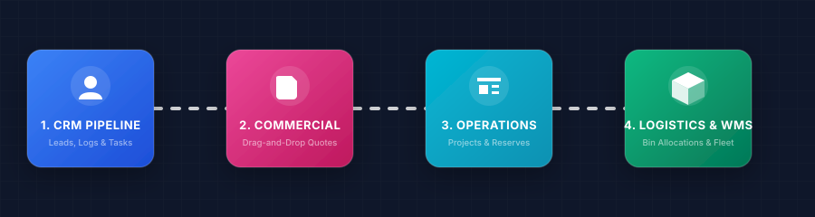
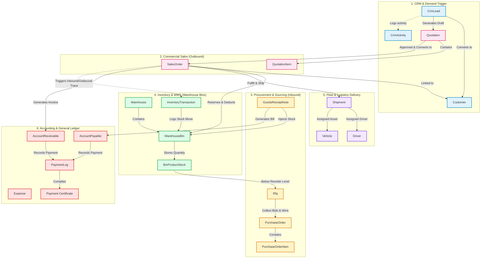
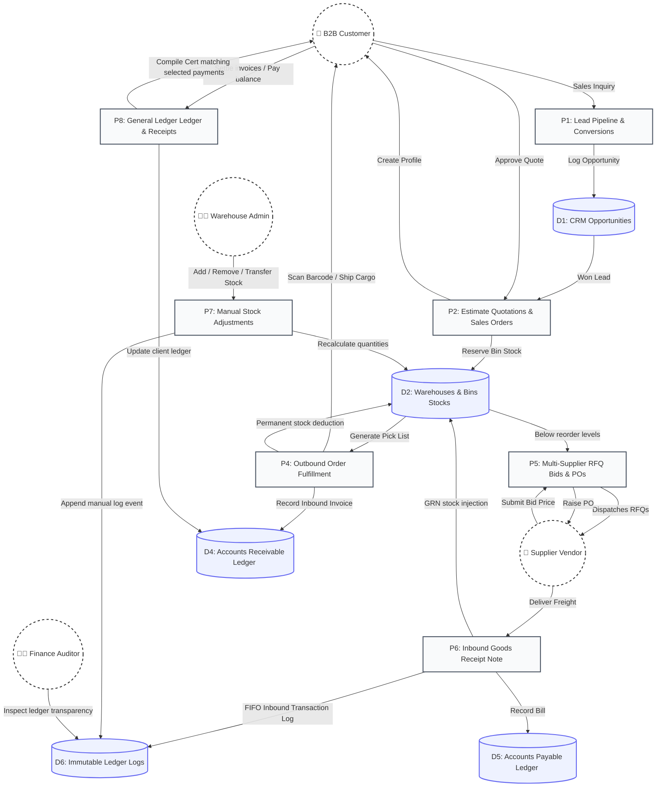
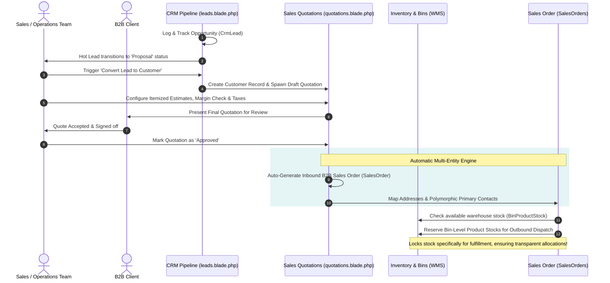
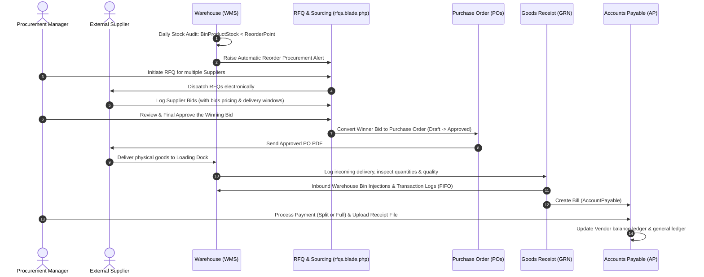
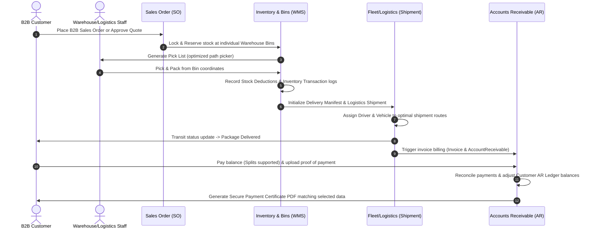

# SCM ERP (Supply Chain Management & Enterprise Resource Planning)

<div align="center">

[](https://laravel.com)
[](https://livewire.laravel.com)
[](https://alpinejs.dev)
[](https://tailwindcss.com)
[](#-license--open-source-agreement)
[](#-user-manuals)

A robust, enterprise-grade Supply Chain Management (SCM) ERP built with **Laravel 11**, **Livewire Volt**, **Alpine.js**, and **Tailwind CSS**. This open-source software provides an end-to-end operational backbone for B2B enterprises, seamlessly connecting Customer Relationship Management (CRM), Sales Quotations, Sales Orders, Procurement (RFQs), multi-zone Warehouse Bins, Fleet Logistics, Quality Control (QC), Bill of Materials (BOM) Manufacturing, and General Ledger financial accounting.

</div>

---

## ⚡ Active Data Pipeline Visualizer

Below is an interactive, CSS-animated data pipeline representing how operational data streams seamlessly through the SCM ERP ecosystem. **Hover over nodes** to inspect active transitions.

<div align="center">
  
</div>

---

## 🎨 SCM Ecosystem Visualizer

This system operates as a unified, data-driven supply chain where customer demand directly triggers physical inventory movements, supplier acquisitions, and financial logs. The diagram below illustrates how all entities interact chronologically across active modules.



---

## 📊 SCM Pipeline Data Flow Diagram (DFD)

This Data Flow Diagram (DFD) maps the movement of data between external entities (users/clients), operational processes, database stores, and physical ledger records, showing how information flows from initial demand triggers through fulfillment and audit logs.



---

## 🔄 Core Workflows & Detailed Data Flows

### 1. Lead-to-Order Conversion Flow
This workflow demonstrates how customer interest captured in the CRM transitions seamlessly into signed contracts, auto-generating a standard B2B Sales Order alongside assigned warehouse stock reservations.



* **CRM Lead Kanban Component:** [leads.blade.php](resources/views/livewire/crm/leads.blade.php) - Manages leads, records client communications, and handles one-click conversions.
* **Customer Profile Console:** [show.blade.php](resources/views/livewire/customers/show.blade.php) - Displays full order history, Outstanding Accounts Receivables (AR) management, and compiled payment certificates.
* **Quotation Management Workspace:** [quotations.blade.php](resources/views/livewire/sales/quotations.blade.php) - Itemized quote calculator that automatically converts won estimates into active sales orders.

---

### 2. Procure-to-Pay Flow (Inbound Stock Lifecycle)
This workflow handles critical inbound sourcing: tracking inventory depletion, dispatching multi-vendor RFQs, recording and evaluating bids, issuing formal POs, generating GRNs upon cargo arrival, and logging corresponding Accounts Payable bills.



* **Supplier RFQ Compiler:** [rfqs.blade.php](resources/views/livewire/procurement/rfqs.blade.php) - Requests bids, logs vendor quotes, and translates approved proposals into standard Purchase Orders.
* **Warehouse Stock Models:** [WarehouseBin.php](app/Models/WarehouseBin.php) & [BinProductStock.php](app/Models/BinProductStock.php) - Tracks real-time quantities across multi-dimensional warehouse coordinate systems.

---

### 3. Order-to-Cash Flow (Outbound Fulfillment & Certificates)
This outbound path covers customer order receipt, inventory matching, Pick list processing in the WMS, driver delivery routing, invoicing, split payment collection, and secure corporate Payment Certificate generation.



* **Receivables Editor & Payments Logs:** [show.blade.php](resources/views/livewire/customers/show.blade.php) - Located inside the Customer Profile view. Allows administrators to modify outstanding receivables and record incoming payments directly.
* **Payment Certificate Generator:** [show.blade.php](resources/views/livewire/customers/show.blade.php) - Allows compiling selected customer payments into a printable/exportable corporate PDF document to verify client transactions.

---

## 📦 System Modules & Core Capabilities (Module-Wise)

### 1. 🤝 Customer Relationship Management (CRM)
Directly captures demand signals and manages early client interaction lifecycles before physical supply-chain execution.
* **CRM Lead Kanban Board:** [leads.blade.php](resources/views/livewire/crm/leads.blade.php) - Features clean columns (`New`, `Contacted`, `Proposal`, `Negotiation`, `Won`, `Lost`) to drag-and-drop active prospects.
* **High-Fidelity Detail Overlay:** Displays chronological client communication timelines, logs interaction details, and permits exporting a clean A4 PDF Lead Sheet.
* **Instant Conversion Engine:** Initiates a automated cascade that converts won leads into Customer Profiles and draft Quotations in one click, logging a 60% probability CRM activity entry.
* **Underlying Database Structures:** [CrmLead.php](app/Models/CrmLead.php) & [CrmActivity.php](app/Models/CrmActivity.php).

### 2. 💼 Commercial Sales & Outbound Orders
Handles customer facing sales channels, quotation workflows, returns, and billing assets.
* **Quotation Canvas Workspace:** [quotations.blade.php](resources/views/livewire/sales/quotations.blade.php) - Combines price estimation models, tax coefficients (GST/VAT), discount matrices, and margins. Converts accepted quotes to Sales Orders.
* **Sales Order Tracker:** [orders/index.blade.php](resources/views/livewire/sales/orders/index.blade.php) - Standardizes outbound fulfillment parameters. Maps polymorphic contacts, sets billing and shipping addresses, and triggers warehouse stock reservations.
* **Customer Profile Console:** [show.blade.php](resources/views/livewire/customers/show.blade.php) - Centralizes transaction history, compiles invoice logs, tracks receivables, and features a compilation drawer to print official corporate Payment Certificates.
* **Return Merchandise Authorization (RMA):** [returns/index.blade.php](resources/views/livewire/sales/returns/index.blade.php) - Coordinates customer reverse logistics, logging and routing returned products for quality checks before reintegrating them.
* **Underlying Database Structures:** [Quotation.php](app/Models/Quotation.php), [SalesOrder.php](app/Models/SalesOrder.php), [Customer.php](app/Models/Customer.php), & [ReturnRequest.php](app/Models/ReturnRequest.php).

### 3. 🏢 Procurement & Supplier Sourcing
Coordinates vendor profiles and manages inbound stock procurement activities.
* **Supplier Directory:** [suppliers/index.blade.php](resources/views/livewire/suppliers/index.blade.php) - Registers vendors, active catalogues, delivery lead-times, and main office coordinates.
* **Supplier RFQ Compiler:** [rfqs.blade.php](resources/views/livewire/procurement/rfqs.blade.php) - Sends electronic Requests for Quotations to multiple vendors, tracks incoming bid prices/delivery frames, and awards POs.
* **Purchase Order (PO) Engine:** [purchase-orders/index.blade.php](resources/views/livewire/procurement/purchase-orders/index.blade.php) - Tracks PO lifecycle states (`Draft`, `Sent`, `Approved`, `Completed`). Automatically draft POs when stock falls below reorder parameters.
* **Goods Receipt Notes (GRN):** [grn/index.blade.php](resources/views/livewire/procurement/grn/index.blade.php) - Premium cargo intake panels featuring progressive completion loading bars, raw material quantity inspectors, and shortage indicators.
* **Underlying Database Structures:** [Supplier.php](app/Models/Supplier.php), [Rfq.php](app/Models/Rfq.php), [RfqBid.php](app/Models/RfqBid.php), [PurchaseOrder.php](app/Models/PurchaseOrder.php), & [GoodsReceiptNote.php](app/Models/GoodsReceiptNote.php).

### 4. 🏭 Warehouse Management System (WMS) & Stock
Maps physical inventory locations and manages stock adjustments.
* **Hierarchical Coordinates Grid:** [warehouses/index.blade.php](resources/views/livewire/warehouses/index.blade.php) - Models locations in spatial dimensions (`Warehouse -> Zone -> Rack -> Bin`).
* **Bin-to-Bin Stock Transfer Engine:** [adjustments.blade.php](resources/views/livewire/inventory/adjustments.blade.php) - Fully transaction-guaranteed transfer engine that verifies source balance, conducts atomic double-entry quantity updates, and creates audit logs.
* **Inventory Audit Ledger:** [log.blade.php](resources/views/livewire/inventory/log.blade.php) - An immutable, read-only audit log tracking every inventory transaction, transfer, and adjustments event with origin tracking (GRNs, Shipments, MOs).
* **Stock Take Console:** [stock-take/index.blade.php](resources/views/livewire/warehouses/stock-take/index.blade.php) - Facilitates cyclical physical stock counts, registering variances and generating adjustments to correct discrepancies.
* **Underlying Database Structures:** [Warehouse.php](app/Models/Warehouse.php), [WarehouseBin.php](app/Models/WarehouseBin.php), [BinProductStock.php](app/Models/BinProductStock.php), [InventoryTransaction.php](app/Models/InventoryTransaction.php), & [StockTake.php](app/Models/StockTake.php).

### 5. 🛠️ Manufacturing & Bill of Materials (BOM)
Orchestrates raw materials assembly into finished products.
* **BOM Recipe Builder:** [bom/index.blade.php](resources/views/livewire/manufacturing/bom/index.blade.php) - Features a drawer layout to detail finished goods components, quantities, and work center resources.
* **Manufacturing Orders (MO) Tracker:** [orders/index.blade.php](resources/views/livewire/manufacturing/orders/index.blade.php) - Monitors production runs through stage pipelines (`Draft`, `Confirmed`, `In Progress`, `Quality Check`, `Completed`).
* **Cascade Deduction Engine:** Automated system checks component availability before release. Upon completion, it automatically decrements raw components from source bins, increments finished goods stocks, flags quality holds, and records general ledger journal lines.
* **Underlying Database Structures:** [BillOfMaterial.php](app/Models/BillOfMaterial.php), [BomItem.php](app/Models/BomItem.php), & [ManufacturingOrder.php](app/Models/ManufacturingOrder.php).

### 6. 🔬 Quality Control & Compliance (QC)
Enforces corporate quality standards and halts defective inventory distribution.
* **Automated Compliance Holds:** Completed manufacturing orders and incoming GRN supplier deliveries automatically lock down under pending inspection.
* **QC Inspector Console:** [quality-checks/index.blade.php](resources/views/livewire/quality-checks/index.blade.php) - Interactive verification panel to inspect products, log defects, upload comments, and log passed/failed verdicts.
* **Release Flow:** Passed verdicts automatically release stock to active warehouse bins, while failed verdicts transfer items to quarantine areas or raise RMAs.
* **Underlying Database Structures:** [QualityCheck.php](app/Models/QualityCheck.php).

### 7. 🚚 Fleet Logistics & Shipping
Coordinates the physical movement of assets, drivers, and cargo manifests.
* **Logistics Dispatch Console:** [dispatch.blade.php](resources/views/livewire/logistics/dispatch.blade.php) - Drag-and-drop shipment assignment panel matching cargo manifests to available fleet assets and drivers.
* **Asset & Driver Registers:** [vehicles/index.blade.php](resources/views/livewire/logistics/vehicles/index.blade.php) & [drivers/index.blade.php](resources/views/livewire/logistics/drivers/index.blade.php) - Monitors driver licenses, vehicle dimensions, capacities, and fuel consumption logs.
* **Fulfillment Logistics:** [shipments/index.blade.php](resources/views/livewire/logistics/shipments/index.blade.php) - Tracks shipment statuses (`Processing`, `Shipped`, `In Transit`, `Delivered`). Triggers Cost of Goods Sold (COGS) debit transactions in the financial ledger upon completion.
* **Underlying Database Structures:** [Shipment.php](app/Models/Shipment.php), [Vehicle.php](app/Models/Vehicle.php), [Driver.php](app/Models/Driver.php), & [FuelAnomaly.php](app/Models/FuelAnomaly.php).

### 8. 💳 Financial Ledgers & General Ledger (GL)
Double-entry accounting engine compiling compliant operational records.
* **General Ledger (GL):** [ledger.blade.php](resources/views/livewire/finance/ledger.blade.php) - Logs all debits and credits dynamically compiled from operational triggers (GRN bills, invoices, shipments).
* **Chart of Accounts:** [accounts.blade.php](resources/views/livewire/finance/accounts.blade.php) - Displays real-time asset, liability, equity, revenue, and expense accounts.
* **Accounts Receivable (AR) & Accounts Payable (AP):** [receivables.blade.php](resources/views/livewire/finance/receivables.blade.php) & [payables.blade.php](resources/views/livewire/finance/payables.blade.php) - Tracks customer outstanding invoices and supplier bills, supporting split payments and receipts upload.
* **Interactive Invoice Manager:** [invoices.blade.php](resources/views/livewire/finance/invoices.blade.php) - Integrated CRUD layout to generate invoices, download PDFs, and print corporate receipts.
* **Underlying Database Structures:** [JournalEntry.php](app/Models/JournalEntry.php), [JournalLine.php](app/Models/JournalLine.php), [Account.php](app/Models/Account.php), [AccountPayable.php](app/Models/AccountPayable.php), [AccountReceivable.php](app/Models/AccountReceivable.php), [Invoice.php](app/Models/Invoice.php), & [PaymentLog.php](app/Models/PaymentLog.php).

### 9. 🤖 Enterprise AI & Demand Forecasting
Optimizes inventory thresholds using intelligent forecasting tools.
* **Demand Forecasting Dashboard:** [forecasting.blade.php](resources/views/livewire/intelligence/forecasting.blade.php) - Displays daily usage velocities and plots depletion trends with lightweight SVG sparkline graphs.
* **Safety Stock Simulator:** Features interactive sliders (from 100% to 200%) to preview projected reorder points, color-coded days-to-stockout warnings (Red/Amber/Green), and a write-back action button.
* **Bulk Purchase Order Builder:** Scans depleted warehouse stocks, maps items to primary suppliers, and builds draft POs in a single step.
* **Console Automation:** [CalculateDemandForecasts.php](app/Console/Commands/CalculateDemandForecasts.php) - Computes daily velocities in background schedules.

---

## ⚖️ Stock Adjustments vs. Inventory Ledger (Audit Separation)

In enterprise-level ERP architectures, a strict separation is maintained between operational calculations (physical inventory alterations) and historical reporting (the ledger trace):

| Dimension | 🏭 Stock Adjustments Console | 📘 Inventory Audit Ledger |
| :--- | :--- | :--- |
| **Purpose** | **Operational Actions:** Administrative panel where staff physically logs additions, removals, or transfers. | **Compliance Logs:** An immutable historical transaction log mapping all SCM ledger adjustments chronologically. |
| **Mutability** | **Active Calculations:** Recomputes actual quantities in the WMS (`bin_product_stocks`). | **Immutable:** Static, read-only transaction ledger entries that cannot be edited or manually added. |
| **Origin Triggers** | Triggered manually by admins for inventory corrections or stock movement transfers. | Spawned automatically by system triggers (GRNs, Shipments, RMAs, or Manual Adjustments). |
| **Capabilities** | Supports manual additions, manual removals, and complex **Bin-to-Bin stock transfers**. | Supports advanced filtering, searching, and product SKU tracking. |

---

## 📖 User Manuals

To make the system operational for any organization, comprehensive user manuals are compiled in multiple formats and embedded directly inside the codebase. You can open, view, or download them directly from the repository links below:

* **[Printable A4 PDF User Manual (PDF)](public/user_manual.pdf)**: Located in the public folder (`public/user_manual.pdf`).
* **[Word Document User Manual (DOCX)](public/user_manual.docx)**: Located in the public folder (`public/user_manual.docx`).
* **Interactive Documentation & FAQ**: Accessible directly at `/faq` inside the ERP portal dashboard.

### Manual Generator Command
If you update database tables, workflows, or seed data, regenerate both manual documents dynamically using the following artisan command:
```bash
php artisan manual:generate
```
*Note: This command runs the Python docx builder script (`app/Console/Commands/generate_manual.py`) and compiles the PDF through DomPDF.*

---

## 🚀 Installation & Local Setup

### Option 1: Docker (Laravel Sail) - *Recommended*
If you have Docker Desktop installed, you can spin up the entire application without local environment configuration:

1. **Clone the Repository**
   ```bash
   git clone https://github.com/YOUR_USERNAME/scm-erp.git
   cd scm-erp
   ```
2. **Install Composer Dependencies** (Using a temporary Docker container)
   ```bash
   docker run --rm \
       -u "$(id -u):$(id -g)" \
       -v "$(pwd):/var/www/html" \
       -w /var/www/html \
       laravelsail/php82-composer:latest \
       composer install --ignore-platform-reqs
   ```
3. **Setup Environment & Start Sail**
   ```bash
   cp .env.example .env
   ./vendor/bin/sail up -d
   ```
4. **Generate Key, Migrate & Seed**
   ```bash
   ./vendor/bin/sail artisan key:generate
   ./vendor/bin/sail artisan migrate --seed
   ./vendor/bin/sail npm install
   ./vendor/bin/sail npm run build
   ```
   Visit `http://localhost` to log in!

### Option 2: Local Setup (Valet, XAMPP, php artisan serve)
1. **Clone the Repository**
   ```bash
   git clone https://github.com/YOUR_USERNAME/scm-erp.git
   cd scm-erp
   ```
2. **Install Dependencies**
   ```bash
   composer install
   npm install && npm run build
   ```
3. **Environment Setup**
   ```bash
   cp .env.example .env
   php artisan key:generate
   ```
   *Update your `.env` file with your local database credentials.*
4. **Database Migration & Seeding**
   ```bash
   php artisan migrate --seed
   ```
   *This migrates the schema and seeds all admin permissions, roles, and standard sample datasets.*
5. **Start the Application**
   ```bash
   php artisan serve
   ```
   Visit `http://localhost:8000` to log in.

### 🔑 Seeded Login Credentials
* **Administrative Email:** `admin@example.com`
* **Administrative Password:** `password`

---

## 📄 License & Open Source Agreement

This project is licensed under the terms of the **MIT License**.

### ⚖️ Custom Modification Clause & Rights

By using, distributing, or contributing to this software, you agree to the terms and conditions outlined in the [LICENSE](LICENSE) file. This software is provided "as is", without warranty of any kind, express or implied.

<!-- YOLO achievement unlock commit - Tue Jun  2 15:38:23 IST 2026 -->
