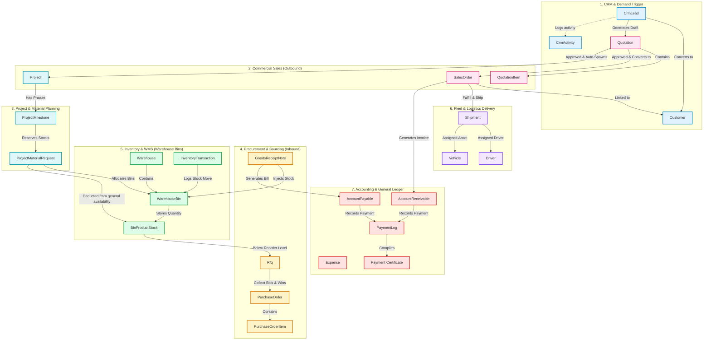
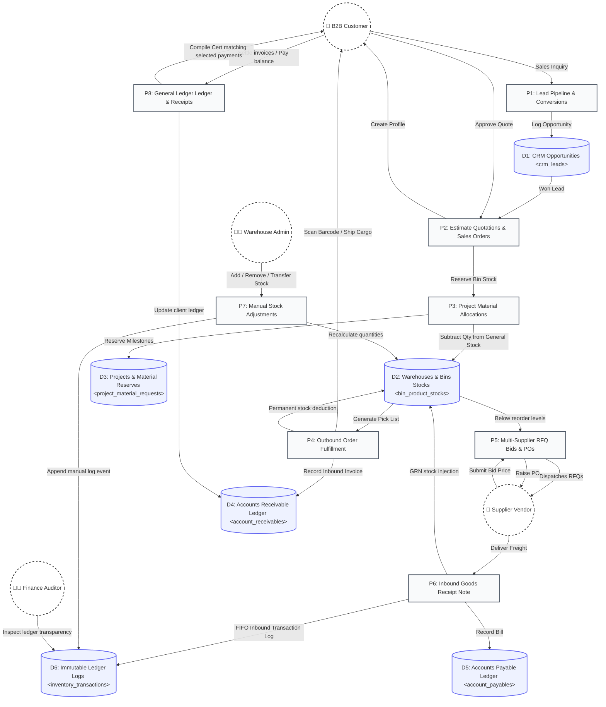
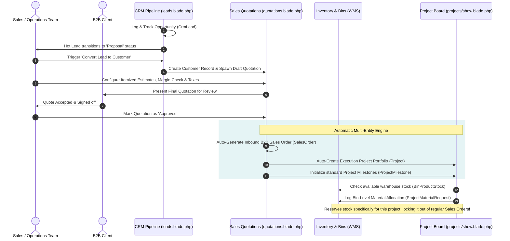
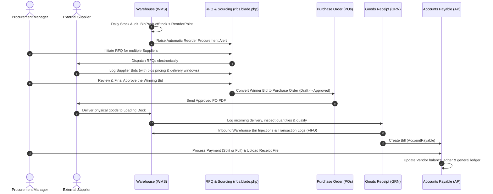
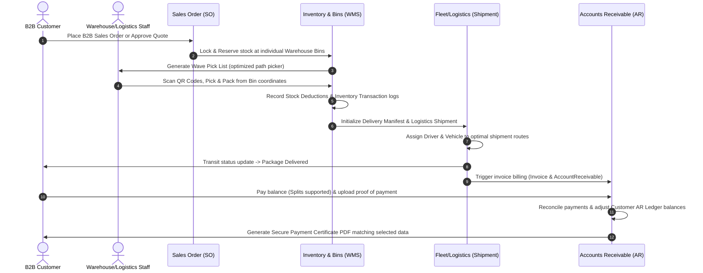

# SCM ERP (Supply Chain Management System)

## ℹ️ About
A robust, enterprise-grade Supply Chain Management (SCM) ERP built with **Laravel 11**, **Livewire Volt**, **Alpine.js**, and **Tailwind CSS**. This open-source software provides an end-to-end operational backbone for B2B enterprises, seamlessly connecting Customer Relationship Management (CRM), Sales Quotations, Project Milestones, Procurement (RFQs), multi-zone Warehouse Bins, Fleet Logistics, and Financial General Ledgers.

---

## ⚡ Active Data Pipeline Visualizer

Below is an interactive, CSS-animated data pipeline representing how operational data streams seamlessly through the SCM ERP ecosystem. **Hover over nodes** to inspect active transitions.

<div align="center">
  <svg width="100%" height="240" viewBox="0 0 900 240" fill="none" xmlns="http://www.w3.org/2000/svg" style="max-width: 900px; width: 100%; border-radius: 12px; background: #0f172a; box-shadow: 0 10px 25px -5px rgba(0, 0, 0, 0.3);">
    <style>
      .node {
        transition: transform 0.3s cubic-bezier(0.4, 0, 0.2, 1), filter 0.3s ease;
        cursor: pointer;
      }
      .node:hover {
        transform: translateY(-6px);
        filter: drop-shadow(0 12px 20px rgba(99, 102, 241, 0.25));
      }
      @keyframes dash {
        to {
          stroke-dashoffset: -40;
        }
      }
      .flow-path {
        stroke-dasharray: 8, 12;
        animation: dash 2.5s linear infinite;
      }
      .text-title {
        font-family: system-ui, -apple-system, sans-serif;
        font-size: 13px;
        font-weight: 700;
        fill: #ffffff;
        letter-spacing: 0.5px;
      }
      .text-subtitle {
        font-family: system-ui, -apple-system, sans-serif;
        font-size: 9.5px;
        font-weight: 500;
        fill: rgba(255, 255, 255, 0.55);
      }
    </style>

    <!-- Background Grid Effect -->
    <defs>
      <pattern id="grid" width="20" height="20" patternUnits="userSpaceOnUse">
        <path d="M 20 0 L 0 0 0 20" fill="none" stroke="rgba(255,255,255,0.03)" stroke-width="1"/>
      </pattern>
      
      <!-- Gradients -->
      <linearGradient id="crm-grad" x1="0" y1="0" x2="1" y2="1">
        <stop offset="0%" stop-color="#3b82f6"/>
        <stop offset="100%" stop-color="#1d4ed8"/>
      </linearGradient>
      <linearGradient id="sales-grad" x1="0" y1="0" x2="1" y2="1">
        <stop offset="0%" stop-color="#ec4899"/>
        <stop offset="100%" stop-color="#be185d"/>
      </linearGradient>
      <linearGradient id="proj-grad" x1="0" y1="0" x2="1" y2="1">
        <stop offset="0%" stop-color="#06b6d4"/>
        <stop offset="100%" stop-color="#0891b2"/>
      </linearGradient>
      <linearGradient id="wms-grad" x1="0" y1="0" x2="1" y2="1">
        <stop offset="0%" stop-color="#10b981"/>
        <stop offset="100%" stop-color="#047857"/>
      </linearGradient>
      
      <linearGradient id="flow-crm-sales" x1="0" y1="0" x2="1" y2="0">
        <stop offset="0%" stop-color="#3b82f6"/>
        <stop offset="100%" stop-color="#ec4899"/>
      </linearGradient>
      <linearGradient id="flow-sales-proj" x1="0" y1="0" x2="1" y2="0">
        <stop offset="0%" stop-color="#ec4899"/>
        <stop offset="100%" stop-color="#06b6d4"/>
      </linearGradient>
      <linearGradient id="flow-proj-wms" x1="0" y1="0" x2="1" y2="0">
        <stop offset="0%" stop-color="#06b6d4"/>
        <stop offset="100%" stop-color="#10b981"/>
      </linearGradient>
    </defs>

    <rect width="100%" height="100%" fill="#0f172a"/>
    <rect width="100%" height="100%" fill="url(#grid)"/>

    <!-- Connecting Pipelines with Running Particles -->
    <path d="M170 120 H250" stroke="url(#flow-crm-sales)" stroke-width="4" stroke-linecap="round"/>
    <path class="flow-path" d="M170 120 H250" stroke="#ffffff" stroke-width="4" stroke-linecap="round" fill="none" opacity="0.8"/>

    <path d="M390 120 H470" stroke="url(#flow-sales-proj)" stroke-width="4" stroke-linecap="round"/>
    <path class="flow-path" d="M390 120 H470" stroke="#ffffff" stroke-width="4" stroke-linecap="round" fill="none" opacity="0.8"/>

    <path d="M610 120 H690" stroke="url(#flow-proj-wms)" stroke-width="4" stroke-linecap="round"/>
    <path class="flow-path" d="M610 120 H690" stroke="#ffffff" stroke-width="4" stroke-linecap="round" fill="none" opacity="0.8"/>

    <!-- Module 1: CRM & Leads -->
    <g class="node" transform="translate(30, 55)">
      <rect width="140" height="130" rx="16" fill="url(#crm-grad)" filter="drop-shadow(0 10px 15px rgba(0,0,0,0.3))"/>
      <rect width="140" height="130" rx="16" stroke="rgba(255,255,255,0.15)" stroke-width="1.5"/>
      <circle cx="70" cy="40" r="22" fill="rgba(255,255,255,0.12)"/>
      <path d="M70 47 C61 47 57 51 57 55 H83 C83 51 79 47 70 47 Z" fill="#ffffff"/>
      <circle cx="70" cy="36" r="7" fill="#ffffff"/>
      <text x="70" y="88" text-anchor="middle" class="text-title">1. CRM PIPELINE</text>
      <text x="70" y="106" text-anchor="middle" class="text-subtitle">Leads, Logs &amp; Tasks</text>
    </g>

    <!-- Module 2: Sales Quotations -->
    <g class="node" transform="translate(250, 55)">
      <rect width="140" height="130" rx="16" fill="url(#sales-grad)" filter="drop-shadow(0 10px 15px rgba(0,0,0,0.3))"/>
      <rect width="140" height="130" rx="16" stroke="rgba(255,255,255,0.15)" stroke-width="1.5"/>
      <circle cx="70" cy="40" r="22" fill="rgba(255,255,255,0.12)"/>
      <path d="M59 29 H72 L78 35 V51 C78 53 76 55 74 55 H59 C57 55 55 53 55 51 V31 C55 29 57 29 59 29 Z" fill="#ffffff"/>
      <path d="M72 29 V35 H78 Z" fill="rgba(255,255,255,0.8)"/>
      <text x="70" y="88" text-anchor="middle" class="text-title">2. COMMERCIAL</text>
      <text x="70" y="106" text-anchor="middle" class="text-subtitle">Drag-and-Drop Quotes</text>
    </g>

    <!-- Module 3: Projects Milestones -->
    <g class="node" transform="translate(470, 55)">
      <rect width="140" height="130" rx="16" fill="url(#proj-grad)" filter="drop-shadow(0 10px 15px rgba(0,0,0,0.3))"/>
      <rect width="140" height="130" rx="16" stroke="rgba(255,255,255,0.15)" stroke-width="1.5"/>
      <circle cx="70" cy="40" r="22" fill="rgba(255,255,255,0.12)"/>
      <path d="M57 31 H83 V35 H57 Z" fill="#ffffff"/>
      <path d="M59 39 H69 V49 H59 Z" fill="#ffffff"/>
      <path d="M73 39 H81 V42 H73 Z" fill="#ffffff"/>
      <path d="M73 46 H81 V49 H73 Z" fill="#ffffff"/>
      <text x="70" y="88" text-anchor="middle" class="text-title">3. OPERATIONS</text>
      <text x="70" y="106" text-anchor="middle" class="text-subtitle">Projects &amp; Reserves</text>
    </g>

    <!-- Module 4: WMS Warehouse Bins -->
    <g class="node" transform="translate(690, 55)">
      <rect width="140" height="130" rx="16" fill="url(#wms-grad)" filter="drop-shadow(0 10px 15px rgba(0,0,0,0.3))"/>
      <rect width="140" height="130" rx="16" stroke="rgba(255,255,255,0.15)" stroke-width="1.5"/>
      <circle cx="70" cy="40" r="22" fill="rgba(255,255,255,0.12)"/>
      <path d="M70 25 L88 34 V52 L70 61 L52 52 V34 Z" fill="#ffffff" fill-opacity="0.3"/>
      <path d="M70 25 L88 34 L70 43 L52 34 Z" fill="#ffffff"/>
      <path d="M52 34 V52 L70 61 V43 Z" fill="rgba(255,255,255,0.8)"/>
      <text x="70" y="88" text-anchor="middle" class="text-title">4. LOGISTICS &amp; WMS</text>
      <text x="70" y="106" text-anchor="middle" class="text-subtitle">Bin Allocations &amp; Fleet</text>
    </g>
  </svg>
</div>

---

## 🎨 SCM Ecosystem Visualizer

This system operates as a unified, data-driven supply chain where customer demand directly triggers physical inventory movements, supplier acquisitions, and financial logs. The diagram below illustrates how all entities interact chronologically across modules.



---

## 📊 SCM Pipeline Data Flow Diagram (DFD)

This Data Flow Diagram (DFD) maps the movement of data between external entities (users/clients), operational processes, database stores, and physical ledger records, showing how information flows from initial demand triggers through fulfillment and audit logs.



---

## 🔄 Core Workflows & Detailed Data Flows

### 1. Lead-to-Project & Order Conversion Flow
This workflow demonstrates how customer interest captured in the CRM transitions seamlessly into signed contracts, auto-generating a standard B2B Sales Order alongside an execution Project Portfolio with designated warehouse stock reservations.



* **CRM Lead Kanban Component:** [leads.blade.php](file:///Applications/XAMPP/xamppfiles/htdocs/scm-erp/resources/views/livewire/crm/leads.blade.php) - Manages leads, records client communications, and handles one-click conversions.
* **Customer Profile Console:** [show.blade.php](file:///Applications/XAMPP/xamppfiles/htdocs/scm-erp/resources/views/livewire/customers/show.blade.php) - Displays full order history, Outstanding Accounts Receivables (AR) management, and compiled payment certificates.
* **Quotation Management Workspace:** [quotations.blade.php](file:///Applications/XAMPP/xamppfiles/htdocs/scm-erp/resources/views/livewire/sales/quotations.blade.php) - Itemized quote calculator that automatically converts won estimates into active projects and orders.
* **Project Dashboard:** [show.blade.php](file:///Applications/XAMPP/xamppfiles/htdocs/scm-erp/resources/views/livewire/projects/show.blade.php) - Tracks progress, milestones, and isolates specific materials in warehouse bins using Project Material Requests to prevent standard sales allocation.

---

### 2. Procure-to-Pay Flow (Inbound Stock Lifecycle)
This workflow handles critical inbound sourcing: tracking inventory depletion, dispatching multi-vendor RFQs, recording and evaluating bids, issuing formal POs, generating GRNs upon cargo arrival, and logging corresponding Accounts Payable bills.



* **Supplier RFQ Compiler:** [rfqs.blade.php](file:///Applications/XAMPP/xamppfiles/htdocs/scm-erp/resources/views/livewire/procurement/rfqs.blade.php) - Requests bids, logs vendor quotes, and translates approved proposals into standard Purchase Orders.
* **Warehouse Stock Models:** [WarehouseBin.php](file:///Applications/XAMPP/xamppfiles/htdocs/scm-erp/app/Models/WarehouseBin.php) & [BinProductStock.php](file:///Applications/XAMPP/xamppfiles/htdocs/scm-erp/app/Models/BinProductStock.php) - Tracks real-time quantities across multi-dimensional warehouse coordinate systems.

---

### 3. Order-to-Cash Flow (Outbound Fulfillment & Certificates)
This outbound path covers customer order receipt, inventory matching, Wave Picking in the WMS, driver delivery routing, invoicing, split payment collection, and secure corporate Payment Certificate generation.



* **Receivables Editor & Payments Logs:** [show.blade.php](file:///Applications/XAMPP/xamppfiles/htdocs/scm-erp/resources/views/livewire/customers/show.blade.php#L150) - Located inside the Customer Profile view. Allows administrators to modify outstanding receivables and record incoming payments directly.
* **Payment Certificate Generator:** [show.blade.php](file:///Applications/XAMPP/xamppfiles/htdocs/scm-erp/resources/views/livewire/customers/show.blade.php#L220) - Allows compiling selected customer payments into a printable/exportable corporate PDF document to verify client transactions.

---

## ⚖️ Stock Adjustments vs. Inventory Ledger (SOX & Audit Compliance)

In enterprise-level ERP architectures, a strict separation is maintained between operational calculations (physical inventory alterations) and historical reporting (the ledger trace):

| Dimension | 🏭 Stock Adjustments Console | 📘 Inventory Audit Ledger |
| :--- | :--- | :--- |
| **Purpose** | **Operational Actions:** Administrative panel where staff physically logs additions, removals, or transfers. | **Compliance Logs:** An immutable historical transaction log mapping all SCM ledger adjustments chronologically. |
| **Mutability** | **Active Calculations:** Recomputes actual quantities in the WMS (`bin_product_stocks`). | **Immutable:** Static, read-only transaction ledger entries that cannot be edited or manually added. |
| **Origin Triggers** | Triggered manually by admins for inventory corrections or stock movement transfers. | Spawned automatically by system triggers (GRNs, Shipments, RMAs, or Manual Adjustments). |
| **Capabilities** | Supports manual additions, manual removals, and complex **Bin-to-Bin stock transfers**. | Supports advanced filtering, searching, and product SKU tracking. |

### ⇅ The Bin-to-Bin Stock Transfer Engine
A custom, high-fidelity stock transfer module has been integrated into the **Manual Stock Adjustments** dashboard:
* **Current Balances Verification:** When an operator transfers stock, the engine validates that the source bin has sufficient physical inventory.
* **Double-Entry Balance Updates:** In a single, transaction-guaranteed block, the system automatically subtracts the selected quantity from the source bin coordinate and adds it to the target bin coordinate (creating a new stock index if the product was not previously present).
* **Unified Audit Logging:** Appends a single comprehensive transaction trace to the **Inventory Audit Ledger** detailing both the `from_bin_id` and the `to_bin_id` alongside user timestamps, ensuring absolute transparency.

---

## 🤖 Enterprise AI Modules

The SCM ERP incorporates advanced Artificial Intelligence capabilities designed to optimize supply chain operations and minimize human error:

- **AI Demand Forecasting (Active):** Utilizes historical sales data and seasonal trend analysis to predict future inventory demand, automatically suggesting optimal restock quantities to prevent stockouts or overstocking.
- **AI Supply Chain Co-Pilot (Upcoming):** An intelligent conversational assistant capable of answering complex natural language queries about supplier reliability, low-stock risks, and operational bottlenecks directly from the ERP database.
- **Smart Document Extraction (Upcoming):** AI OCR models intended to automatically parse PDF invoices and supplier quotations, instantly extracting line items, prices, and totals to eliminate manual data entry.
- **Supplier Risk Scoring (Upcoming):** A machine learning model that continuously evaluates supplier trust scores based on delivery delay patterns and defect rates to warn procurement officers before issuing massive Purchase Orders.

---

## 🌟 Key Features Summary

### 📦 Procurement & Suppliers
- **Supplier Directory:** Comprehensive management of vendor details and performance metrics.
- **Request for Quotation (RFQ):** Dispatch items to multiple suppliers and record vendor pricing side-by-side.
- **Purchase Orders (POs):** Generate, approve, and track POs.
- **Goods Receipt Notes (GRN):** Log incoming deliveries against POs with partial receipt support.

### 🏭 Inventory & Warehouse Management (WMS)
- **Multi-Warehouse & Rack Tracking:** Define warehouses, zones, racks, rows, and individual bins.
- **Stock Tracking:** Real-time inventory logs with `source` and `destination` bin traceability.
- **Stock Take & Adjustments:** Perform routine inventory audits and manual discrepancy adjustments.
- **Bin-to-Bin Stock Transfer Engine:** Transaction-guaranteed manual stock transfers with double-entry balance updates and comprehensive audit ledger logs.

### 💼 Sales & CRM
- **CRM Kanban Board:** Beautiful lead capture columns ("New", "Contacted", "Proposal", "Negotiation", "Won", "Lost") to track opportunities.
- **CRM Details Overlay:** High-fidelity opportunity detail modal with chronological interaction logs, A4 lead sheet printing, and direct SCM conversions.
- **Quotation Kanban Board:** Interactive, drag-and-drop quotation pipeline (`Draft`, `Sent`, `Accepted`, `Rejected`) with live deal volume trackers.
- **SCM Cascade Engine:** Automatic conversion of `Accepted` quotes into standard B2B Sales Orders and Milestones Projects with bin-level material reservations.
- **A4 Corporate Letterhead Isolation**: Native print isolator overlays and SHA-256 ERP verification hashes for invoices, quotations, and project files.
- **Lead Auto-Conversion:** Instantly convert won leads into Customer Profiles and draft Quotations.
- **Quotation Engine:** Dynamic tax, discount, and landed cost estimations.
- **Sales Orders (SOs):** Pick, pack, and ship items directly from assigned inventory bins.
- **Returns (RMA):** Process and log customer returns directly into inventory.

### 🏗️ Project Management
- **Milestone Sourcing:** Connect project schedules directly to supply chain procurement.
- **Dedicated Material Allocations:** Reserve specific warehouse bin inventory to projects so it cannot be sold to general sales orders.

### 🚚 Fleet & Logistics
- **Driver & Vehicle Management:** Log active vehicles, drivers, and asset schedules.
- **Shipment Tracking:** Assign drivers to specific fulfillment orders and track delivery statuses.

### 💳 Finance & Accounting
- **Interactive Invoice CRUD:** Full invoice editing, deleting, dynamic detail sheets, and custom PDF generator.
- **Accounts Payable (AP):** Track supplier bills, split payments, and upload receipts.
- **Accounts Receivable (AR):** Manage customer invoices, split payments, and record transactions.
- **Outstanding Progress Bar:** Dynamic, real-time receivables status meter in the primary SCM dashboard.
- **Payment Certificate Compiler:** Generates custom-itemized corporate receipts for selected payments in PDF format.

### 🛡️ System Administration & Local Hosting
- **FixSubfolderIntendedUrl Middleware:** Solves XAMPP session-expiration redirect bypass bug under subdirectory installations (e.g. `/scm-erp/`).
- **Dynamic Filters:** Real-time timezone middleware integration and dashboard financial reporting interval parameters.
- **Root Redirection:** Automatic guest fallback from `/` to named route `'login'` with obsolete file clean-ups.


---

## 🚀 Installation Guide

### Option 1: Docker (Laravel Sail) - *Recommended*
If you have Docker Desktop installed, you can spin up the entire application without local environment configuration:

1. **Clone the Repository**
   ```bash
   git clone https://github.com/YOUR_USERNAME/scm-erp.git
   cd scm-erp
   ```
2. **Install Composer Dependencies** (Using a temporary Docker container)
   ```bash
   docker run --rm \
       -u "$(id -u):$(id -g)" \
       -v "$(pwd):/var/www/html" \
       -w /var/www/html \
       laravelsail/php82-composer:latest \
       composer install --ignore-platform-reqs
   ```
3. **Setup Environment & Start Sail**
   ```bash
   cp .env.example .env
   ./vendor/bin/sail up -d
   ```
4. **Generate Key, Migrate & Seed**
   ```bash
   ./vendor/bin/sail artisan key:generate
   ./vendor/bin/sail artisan migrate --seed
   ./vendor/bin/sail npm install
   ./vendor/bin/sail npm run build
   ```
   Visit `http://localhost` to log in!

### Option 2: Local Setup (Valet, XAMPP, etc.)
1. **Clone the Repository**
   ```bash
   git clone https://github.com/YOUR_USERNAME/scm-erp.git
   cd scm-erp
   ```

2. **Install Dependencies**
   ```bash
   composer install
   npm install && npm run build
   ```

3. **Environment Setup**
   ```bash
   cp .env.example .env
   php artisan key:generate
   ```
   *Update your `.env` file with your local database credentials.*

4. **Database Migration & Seeding**
   ```bash
   php artisan migrate --seed
   ```
   *This migrates the schema and seeds all admin permissions, module roles, and standard sample datasets.*

5. **Start the Application**
   ```bash
   php artisan serve
   ```
   Visit `http://localhost:8000` to log in.

---

## 🤝 Contributing

To maintain code integrity, the `main` branch is strictly **protected**. **You cannot push code directly to `main`.**

### Contribution Workflow:
1. **Fork** the repository.
2. **Create a branch** for your feature: `git checkout -b feature/my-new-feature`
3. **Commit** your changes: `git commit -m "Add new feature"`
4. **Push** to your fork: `git push origin feature/my-new-feature`
5. **Open a Pull Request (PR)** against the `main` branch.

*All PRs require automated test passes and code review approval before merging.*

---
*Built with ❤️ using Laravel & Livewire.*

---

## 📄 License & Open Source Agreement

This project is licensed under the **MIT License**. 

By using, distributing, or contributing to this software, you agree to the terms and conditions outlined in the [LICENSE](LICENSE) file. This software is provided "as is", without warranty of any kind, express or implied.
